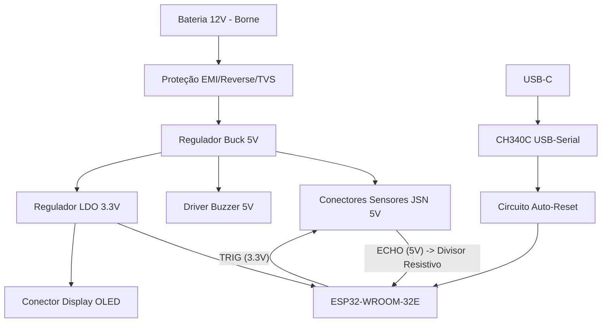

# Projeto de Engenharia: PCB Sensor de Ré Automotivo (ESP32)

Este documento contém o projeto de hardware completo, estruturado em netlist textual, Bill of Materials (BOM) e diretrizes de layout, perfeitamente formatado para servir de referência base para o roteamento no **KiCad v8**.

A arquitetura final adotada com base nas suas diretrizes foi:
* **Sensores:** 4x JSN-SR04T (Prova d'água 5V).
* **Programação:** USB-C com CH340C on-board e circuito de auto-reset.
* **Conectividade:** Borne (KRE) para alimentação 12V; conectores de engate rápido (tipo JST XH 2.54mm ou Molex) para periféricos.

---

## 1. Diagrama de Blocos

---

## 2. Esquemático Estruturado (Netlist Textual)

Ao abrir o KiCad Schematic Editor (Eeschema), agrupe o circuito da seguinte forma:

### Bloco A: Alimentação (Power Supply 12V -> 5V -> 3.3V)
* **J1 (Alimentação Automotiva):** Conector Borne 2 vias (Pitch 5.08mm).
  * Pino 1: VCC_12V_RAW
  * Pino 2: GND_PWR
* **Proteções de Entrada:**
  * **F1 (PTC 1.5A):** Em série com VCC_12V_RAW -> Node A.
  * **D1 (TVS SMCJ24CA):** Entre Node A e GND_PWR. Absorve transientes e load-dumps do alternador.
  * **D2 (Diodo Schottky SS34):** Anodo no Node A, Catodo no Node B. Protege contra inversão de bateria.
  * **Filtro Pi (LC):** C1 (100uF Eletrolítico) + C2 (100nF Cerâmico) entre Node B e GND. Indutor L1 (10uH) em série entre Node B e VCC_12V_CLEAN.
* **Buck Converter 5V (U1 - LM2596S-5.0 - Simplificado para SMD):**
  * *Nota: Usaremos o LM2596 por ser extremamente acessível e exigir poucos componentes externos.*
  * IN: VCC_12V_CLEAN.
  * GND: GND_PWR.
  * SW/OUT: Ligado ao D3 (Diodo Schottky SS34 para GND) e Indutor L2 (33uH).
  * Saída do L2 -> VCC_5V.
  * FB: Ligado diretamente ao VCC_5V (versão de tensão fixa).
  * Capacitor de saída C3 (220uF Eletrolítico) + C4 (100nF) no VCC_5V para GND.
* **Regulador LDO 3.3V (U2 - AMS1117-3.3):**
  * IN: VCC_5V.
  * GND: GND_PWR.
  * OUT: VCC_3V3.
  * C5 (10uF Tântalo/Cerâmico) na entrada, C6 (10uF Tântalo/Cerâmico) na saída.

### Bloco B: ESP32 e Circuito de Boot
* **U3 (Módulo ESP32-WROOM-32E):**
  * VCC: VCC_3V3.
  * GND: GND_PWR e Pad Central.
  * **EN (Reset):** Resistor R1 (10k) para 3V3, Capacitor C7 (1uF) para GND. Ligado ao coletor de Q1 (Auto-Reset).
  * **Strapping Pins:**
    * IO0: Ligado ao coletor de Q2 (Auto-Reset). Possui pull-up interno, mas adicione R2 (10k) para 3V3.
    * IO2: Pulldown interno, deixe flutuante.
* **Desacoplamento:** C8 (10uF) e C9 (100nF) muito próximos aos pinos 3V3 do ESP32.

### Bloco C: Programação USB-C e CH340C
* **J2 (Conector USB-C 16-Pinos SMD):**
  * VBUS: VCC_USB.
  * GND: GND_PWR.
  * CC1, CC2: Resistores R3, R4 (5.1k) para GND (Negociação 5V).
  * D+, D-: Ligados ao U4.
* **U4 (CH340C - Versão com oscilador interno):**
  * VCC: VCC_3V3 (ou VCC_USB com pino V3 ligado a 3.3V para lógica 3.3V. **Recomendado:** Alimentar chip com VCC_3V3 e ligar pino V3 ao VCC_3V3 também).
  * UD+, UD-: Para J2.
  * TXD -> RXD0 do ESP32.
  * RXD <- TXD0 do ESP32.
  * DTR e RTS: Para o circuito auto-reset.
* **Circuito Auto-Reset:**
  * Q1 (S8050 NPN): Base em série com R5 (1k) ligado ao RTS. Emissor no GND. Coletor no pino EN.
  * Q2 (S8050 NPN): Base em série com R6 (1k) ligado ao DTR. Emissor no GND. Coletor no pino IO0.
  * Ligação cruzada: RTS vai pro Emissor do Q2. DTR vai pro Emissor do Q1. *(Padrão NodeMCU ESP32)*.

### Bloco D: Sensores JSN-SR04T e Level Shifting
* **Conectores J3, J4, J5, J6 (JST XH-4):** Esquerda, C-Esq, C-Dir, Direita.
  * Pinos 1 a 4: VCC_5V, TRIG_X, ECHO_X_RAW, GND_PWR.
* **Interface TRIG (3.3V do ESP para 5V do Sensor):**
  * O JSN reconhece HIGH com 3.3V, conexão direta é suficiente.
  * R_TRIG (100 ohm) em série para atenuar EMI.
  * ESP GPIO (5, 4, 26, 27) -> R_TRIG -> Pino TRIG do JST.
* **Interface ECHO (5V do Sensor para 3.3V do ESP):**
  * É **OBRIGATÓRIO** usar divisor de tensão para não queimar o ESP32.
  * ECHO_RAW do conector JST vai para um Resistor R_H (1k).
  * Outro lado do R_H vai para a GPIO do ESP32 e para um R_L (2k) ligado ao GND.
  * Relação (2k / 3k) * 5V = 3.33V seguro para o ESP32.
  * Opcional: Diodo Zener 3.3V em paralelo com R_L para proteção extra.

### Bloco E: Periféricos (Display e Buzzer)
* **J7 (Display I2C JST XH-4):** VCC_3V3, GND_PWR, SCL (IO22), SDA (IO21).
  * Resistores R_PU_SCL e R_PU_SDA (4.7k) para VCC_3V3.
* **Driver do Buzzer:**
  * J8 (Conector JST XH-2): Pino 1 no VCC_5V, Pino 2 no Dreno de Q3.
  * Q3 (MOSFET N-Channel 2N7002 / AO3400): Source no GND. Gate ligado à GPIO 17 do ESP32 através de R_GATE (330 ohm) em série, e R_PD (10k) pro GND.
  * D3 (Diodo 1N4148): Flyback em antiparalelo com J8 (Catodo no VCC_5V, Anodo no Dreno de Q3).

---

## 3. Bill of Materials (BOM)

| Ref. | Qtd | Descrição / Valor | Encapsulamento (Footprint) | Fabricante Sugerido / Part Number |
| :--- | :--- | :--- | :--- | :--- |
| **Módulos/ICs** | | | | |
| U3 | 1 | ESP32-WROOM-32E (Módulo Wi-Fi/BT) | ESP32-WROOM-32 | Espressif Systems |
| U1 | 1 | LM2596S-5.0 (Regulador Buck 5V 3A) | TO-263-5 | Texas Instruments / HTC |
| U2 | 1 | AMS1117-3.3 (Regulador LDO 3.3V 1A) | SOT-223 | AMS / Diodes Inc. |
| U4 | 1 | CH340C (Conversor USB-Serial c/ Osc.) | SOP-16 | WCH |
| **Proteção / Discretos** | | | | |
| F1 | 1 | Fusível PTC 1.5A / 16V | SMD 1812 | Bourns MF-MSMF150 |
| D1 | 1 | Diodo TVS Bidirecional 24V (SMCJ24CA) | DO-214AB (SMC) | Littelfuse |
| D2, D3 | 2 | Diodo Schottky 3A 40V (SS34) | DO-214AC (SMA) | Onsemi |
| D4 | 1 | Diodo de Sinal 1N4148W (Flyback) | SOD-123 | Diodes Inc. |
| Q1, Q2 | 2 | Transistor NPN S8050 | SOT-23 | Fairchild/Onsemi |
| Q3 | 1 | MOSFET N-Channel AO3400 (ou 2N7002) | SOT-23 | Alpha & Omega |
| **Passivos (R/L/C)** | | | | |
| L1 | 1 | Indutor 10uH (Filtro EMI) | SMD 0805 ou Bobina | Wurth / Murata |
| L2 | 1 | Indutor de Potência 33uH (Para o Buck) | SMD 12x12 ou Radial | Bourns SRR1208 |
| C1 | 1 | Cap Eletrolítico 100uF / 35V | SMD Alum 8x10 | Panasonic |
| C3 | 1 | Cap Eletrolítico 220uF / 10V | SMD Alum 8x10 | Panasonic |
| C5, C6 | 2 | Cap Cerâmico 10uF / 10V | SMD 0805 | Yageo / Samsung |
| C2, C4, C8, C9 | 4 | Cap Cerâmico 100nF (0.1uF) / 50V | SMD 0603 | Yageo / Samsung |
| C7 | 1 | Cap Cerâmico 1uF / 10V | SMD 0603 | Yageo / Samsung |
| R_H (Divisor) | 4 | Resistor 1kΩ 1% | SMD 0603 | Yageo |
| R_L (Divisor) | 4 | Resistor 2kΩ 1% | SMD 0603 | Yageo |
| Resistores Aux | 15 | Diversos: 10k, 5.1k, 1k, 330R, 100R | SMD 0603 | Yageo |
| **Conectores** | | | | |
| J1 | 1 | Borne KRE 2 Vias (Pitch 5.08mm) | THT 5.08mm | Phoenix Contact / Genérico |
| J2 | 1 | Conector USB-C (16-Pin / SMD) | USB-C SMD | Amphenol / Genérico |
| J3 a J6 | 4 | Conector JST XH 4-Pinos (Sensores) | THT 2.50mm | JST |
| J7 | 1 | Conector JST XH 4-Pinos (Display) | THT 2.50mm | JST |
| J8 | 1 | Conector JST XH 2-Pinos (Buzzer) | THT 2.50mm | JST |

---

## 4. Recomendações Críticas de Layout de PCB (KiCad)

Para que o sistema seja aprovado para ambiente automotivo e isento de interferências causadas pelo motor do carro, siga rigorosamente as diretrizes abaixo no roteamento da placa (Pcbnew):

1. **Posicionamento e Ground Planes (Planos de Terra):**
   * Placa de dupla face (2 layers).
   * **PREENCHIMENTO DE GND:** Preencha ambas as faces (Top e Bottom) com `GND_PWR`. Adicione dezenas de Vias de "Costura" (Stitching Vias) ligando o GND Top ao GND Bottom para garantir baixa impedância de retorno e excelente dissipação térmica.
   * **Antena do ESP32:** O módulo ESP32 possui uma antena na ponta (Keep-out zone). Posicione o ESP32 na borda da placa e **NÃO** coloque cobre (nem trilhas, nem preenchimento GND) em NENHUMA das layers sob a região da antena.
2. **Separação de Potência (Reguladores):**
   * Posicione o conector de 12V, o Diodo SS34, o TVS e o circuito do LM2596 em um canto da placa.
   * As trilhas do nó de acoplamento do indutor do LM2596 (Pino SW/Diodo/Indutor) devem ser **as mais curtas e grossas possíveis**, pois alternam correntes altas em alta frequência (emitem ruído RF).
   * Mantenha o capacitor de bypass (`C4`) e os do LDO (`C5`, `C6`) fisicamente encostados nos pinos de tensão de entrada dos CIs.
3. **Largura de Trilhas (Trace Width):**
   * Sinais lógicos (TRIG, ECHO, RX, TX, I2C): `0.25mm` (10 mils).
   * Malha de alimentação secundária (3.3V do ESP32): `0.5mm` a `0.8mm` (O ESP32 exige picos rápidos de corrente de até 500mA no momento de transmissão WiFi. Trilhas finas causarão *Brownout Reset*).
   * Malha de alimentação primária (12V e trilhas de 5V para os 4 sensores JSN): `1.0mm` a `1.5mm` no mínimo, pois somados eles podem demandar correntes consideráveis da placa.
4. **Proteções de Sinal (Sensors Interface):**
   * Coloque os resistores do divisor de tensão (1k e 2k) bem **próximos aos pinos do ESP32**, e não próximos aos conectores. Isso protege as trilhas ao longo da placa contra captação de ruídos.
   * Não passe as trilhas de `I2C` (Display) ou `ECHO` paralelas às trilhas do regulador DC-DC chaveado.

## 5. Justificativas Técnicas do Projeto

* **Por que TVS + Filtro LC?** A bateria do carro sofre "load dumps" (quando um motor de arranque desliga) gerando picos de 60V a 100V. O Diodo TVS absorve picos absurdos, enquanto o filtro LC corta o "chiado" agudo das velas do motor e do alternador, evitando que falsas leituras ocorram nos sensores ultrassônicos.
* **Por que o LM2596 e o AMS1117 separados?** Reduzir 12V direto para 3.3V usando um regulador linear faria a placa derreter (dissipação enorme de calor). O Buck (LM2596) desce de 12V para 5V sem gerar quase nada de calor (alta eficiência). O LDO (AMS1117) entra na sequência apenas para os 3.3V, fornecendo uma tensão absurdamente limpa de ruídos (o que os módulos WiFi exigem).
* **Por que Divisores Resistivos ao invés de CIs Level Shifters?** O pino ECHO tem baixa frequência. Um divisor de tensão usando bons resistores SMD (1%) custa frações de centavo e é à prova de falhas mecânicas/lógicas em temperaturas altas do carro, sendo superior ao uso de CIs (ex: TXB0104) para este fim simples e unidirecional.
